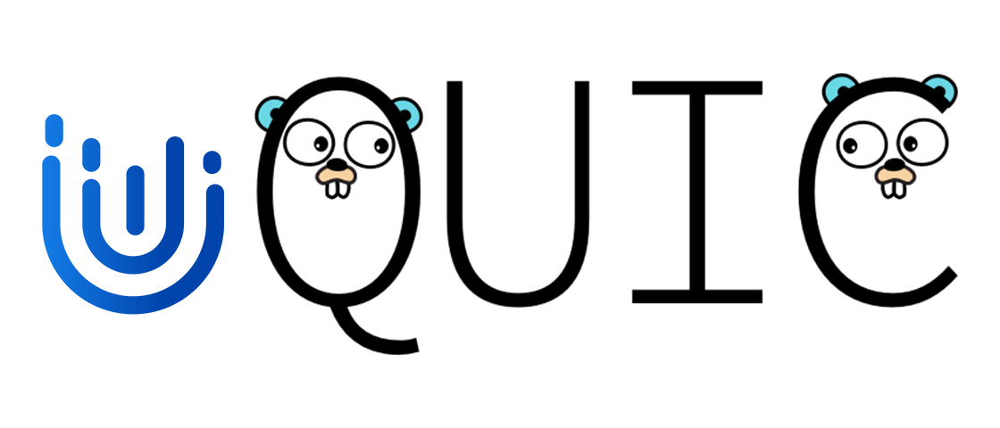

# <div>  <span style="vertical-align:middle">uQUIC</span> </div>

[](https://github.com/refraction-networking/uquic/actions/workflows/go_build.yml)
[](https://github.com/refraction-networking/uquic/actions/workflows/ginkgo_test.yml)
[](https://godoc.org/github.com/refraction-networking/uquic)
---
uQUIC is a fork of [quic-go](https://github.com/quic-go/quic-go), which provides Initial Packet fingerprinting resistance and other features. While the handshake is still performed by quic-go, this library provides interface to customize the unencrypted Initial Packet which may reveal fingerprint-able information. 

Golang 1.20+ is required.

If you have any questions, bug reports or contributions, you are welcome to publish those on GitHub. You may also reach out to one of the maintainers via gaukas.wang@colorado.edu.

Development is still in progress and we welcome any contributions adding new features or fixing extant bugs.

# Disclaimer
This repository belongs to a large research project on how to fingerprint QUIC clients and how to mitigate such fingerprinting. We do not encourage any malicious use of this project's output, including this repository, [uTLS](https://github.com/refraction-networking/utls), and [clienthellod](https://github.com/gaukas/clienthellod).

Our research paper is still yet to be published and therefore this repository is neither ready for production use nor peer-reviewed. And the scope of our research is limited that such mimicry backed by this library MAY NOT be realisticly indistinguishable from the real QUIC clients being mimicked, and some misuses of this library MAY lead to easier fingerprinting against the mimic. We welcome any contributions to improve the realism of the mimicry, as well as expanding the scope of this project. 

For anyone intending to use this library for censorship circumvention, please be sure to understand the risks and limitations of this library. 

If you are interested in our research, please stay tuned for our paper.

# Development in Progress
## Development Roadmap
- [ ] Customize Initial Packet 
	- [x] QUIC Header 
	- [x] QUIC Frame (~~[#3](https://github.com/refraction-networking/uquic/issues/3)~~)
		- [x] QUIC Crypto Frame
		- [x] QUIC Padding Frame
		- [x] QUIC Ping Frame
		- [ ] QUIC ACK Frame (on hold)
	- [x] TLS ClientHello Message (by [uTLS](https://github.com/refraction-networking/utls))
		- [x] QUIC Transport Parameters (in a uTLS extension)
- [ ] Customize Initial ACK behavior ([#1](https://github.com/refraction-networking/uquic/issues/1), [quic-go#4007](https://github.com/quic-go/quic-go/issues/4007))
- [ ] Customize Initial Retry behavior ([#2](https://github.com/refraction-networking/uquic/issues/2))
- [ ] Add preset QUIC parrots
	- [x] Google Chrome parrot (call for parrots w/ `Token/PSK`)
	- [x] Mozilla Firefox parrot (call for parrots w/ `Token/PSK`)
	- [ ] Apple Safari parrot
	- [ ] Microsoft Edge parrot

# Features
## Initial Packet fingerprinting resistance
uQUIC provides a mechanism to customize the Initial Packet, which is unencrypted and is almost unique to every QUIC client implementation. We provide an interface to customize the Initial Packet and makes the fingerprinting of QUIC clients harder.

### Build a QUIC Spec
A QUIC Spec sets parameters and policies for uQUIC in establishing a QUIC connection. 

See `u_parrot.go` for examples of building a QUIC Spec (parrot).

### Use a preset QUIC Spec
We provide a few preset QUIC Specs (parrots) for popular QUIC clients in `u_parrot.go`.

To use one, simple invoke `QUICID2Spec(id)`. See below for a complete example of using a preset QUIC Spec in an HTTP3 client.

```go
package main

import (
	"bytes"
	"fmt"
	"io"
	"log"
	"net/http"

	tls "github.com/refraction-networking/utls"

	quic "github.com/refraction-networking/uquic"
	"github.com/refraction-networking/uquic/http3"
)

func main() {
	roundTripper := &http3.RoundTripper{
		TLSClientConfig: &tls.Config{},
		QuicConfig:      &quic.Config{},
	}

	quicSpec, err := quic.QUICID2Spec(quic.QUICFirefox_116)
	// quicSpec, err := quic.QUICID2Spec(quic.QUICChrome_115)
	if err != nil {
		log.Fatal(err)
	}

	uRoundTripper := http3.GetURoundTripper(
		roundTripper,
		&quicSpec,
		// getCRQUICSpec(),
		nil,
	)
	defer uRoundTripper.Close()

	h3client := &http.Client{
		Transport: uRoundTripper,
	}

	addr := "https://quic.tlsfingerprint.io/qfp/?beautify=true"

	rsp, err := h3client.Get(addr)
	if err != nil {
		log.Fatal(err)
	}
	fmt.Printf("Got response for %s: %#v", addr, rsp)

	body := &bytes.Buffer{}
	_, err = io.Copy(body, rsp.Body)
	if err != nil {
		log.Fatal(err)
	}
	fmt.Printf("Response Body: %s", body.Bytes())
}
```
